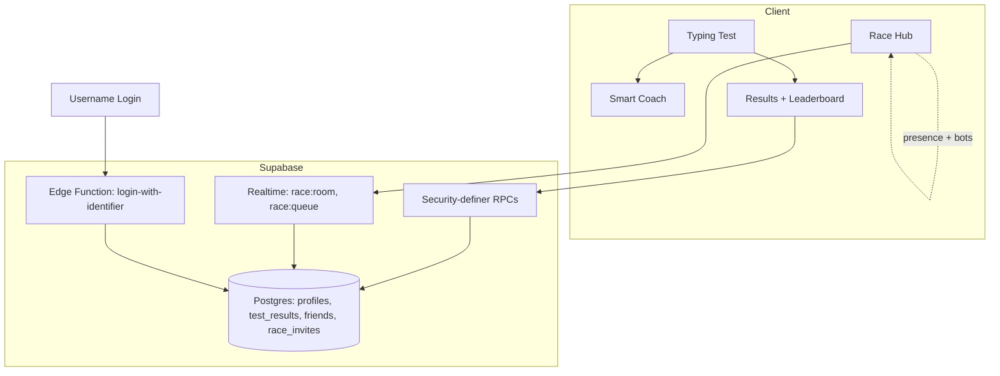

# Type Faster

A typing test app with personalized practice drills and live multiplayer racing —
built as a React + Vite web app and shipped natively to iOS and Android via Capacitor.

> This repository is a portfolio case study. The app is closed-source; screenshots,
> architecture notes, and engineering write-ups live here so the work can be reviewed
> without exposing the codebase.

## Screenshots

  
  
  

  
  

## Tech Stack

- **React 18, Vite, Tailwind CSS** — the web client
- **Capacitor** — native iOS and Android wrappers over the same web codebase, with platform-specific release signing
- **Supabase** — Postgres + Row Level Security, Realtime channels, and Edge Functions as the backend
- **Security-definer RPCs** — `get_leaderboard`, `get_wpm_percentile`, `username_available` run server-side so anonymous clients never query raw tables directly
- **Realtime presence + broadcast** — race rooms, matchmaking queues, and live opponent positions all run over Supabase Realtime channels
- **i18n from the ground up** — 6 typing languages including Arabic, with a fully separate app-UI localization layer (EN/AR) that mirrors layout, not just text, in RTL

## Architecture

**Race matchmaking** elects a leader per room over Realtime presence, then fills empty
seats with skill-matched bots that join the room the same way a real player would —
same presence events, same avatar broadcast — so a race never sits waiting for
players who aren't coming.

## Engineering Highlights

**Skill-matched bots that don't feel like bots.** Empty race lobby seats fill with
bots selected to match the player's recent WPM, joining through the same presence
channel and avatar-broadcast path a real opponent would use — matchmaking, not a
fake-progress-bar simulation bolted on afterward.

**Buildable racer avatars over a tiny wire format.** Each racer's look is a compact
config object (`{c, e, m, g}` for color/eyes/mouth/gear) built client-side into an SVG
and broadcast over presence — enough visual variety for a race to feel populated
without shipping avatar images over the wire.

**Arabic isn't just mirrored, it's rendered correctly.** Connected Arabic script broke
under the obvious fix: per-character `inline-block` spans (needed elsewhere for
per-key coloring) kill Arabic's cursive letter-joining. The fix keeps RTL character
spans `inline` while non-RTL spans stay `inline-block`, so typing-accuracy coloring
and correct Arabic shaping coexist instead of trading off against each other.

**A backend gotcha that only shows up in production traffic patterns.** The Supabase
Edge Function used for username-based login 404s on `Content-Type: application/json`
— it only accepts `text/plain`. Easy to miss locally if your test client always sets
JSON headers by default; the fix is a one-line content-type change on the client,
but finding it meant reading the gateway's actual behavior instead of assuming REST
conventions apply uniformly.

**Security pushed to the database, not just the API layer.** Leaderboard queries,
percentile calculation, and username-availability checks all run as `security
definer` Postgres functions rather than plain table reads — anonymous clients call a
function with a narrow, intentional surface instead of querying `test_results`
directly under RLS, so the policy surface stays small and auditable.

## More from this developer

- [Tanweer for iOS](https://github.com/lqji/tanweer-ios-showcase) — a Quran, prayer times, and Qiblah companion app
- [Tanweer for Android](https://github.com/lqji/tanweer-android-showcase) — the same app ported to Kotlin + Jetpack Compose
- [Full portfolio →](https://github.com/lqji/portfolio)

---

Built and maintained by **Ahmed Abdullah**.
