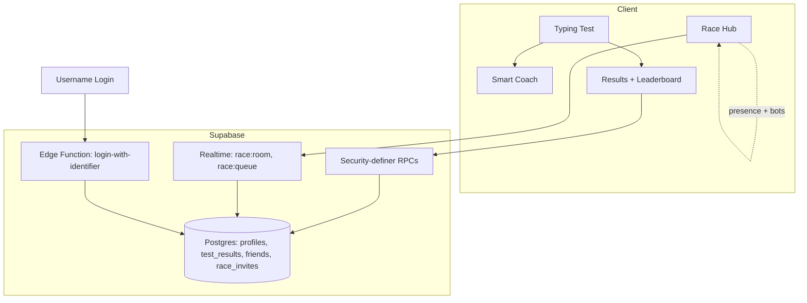

# Type Faster

A typing test app with personalized practice drills and live multiplayer racing —
built as a React + Vite web app and shipped natively to iOS and Android via Capacitor.

> This repository is a portfolio case study. The app is closed-source; screenshots,
> architecture notes, and engineering write-ups live here so the work can be reviewed
> without exposing the codebase.

## Screenshots

  
  
  

  
  

## Tech Stack

- **React 18, Vite, Tailwind CSS** — the web client
- **Capacitor** — native iOS and Android wrappers over the same web codebase, with platform-specific release signing
- **Supabase** — Postgres + Row Level Security, Realtime channels, and Edge Functions as the backend
- **Security-definer RPCs** — `get_leaderboard`, `get_wpm_percentile`, `username_available` run server-side so anonymous clients never query raw tables directly
- **Realtime presence + broadcast** — race rooms, matchmaking queues, and live opponent positions all run over Supabase Realtime channels
- **i18n from the ground up** — 6 typing languages including Arabic, with a fully separate app-UI localization layer (EN/AR) that mirrors layout, not just text, in RTL

## Architecture

**Race matchmaking** elects a leader per room over Realtime presence, then fills empty
seats with skill-matched bots that join the room the same way a real player would —
same presence events, same avatar broadcast — so a race never sits waiting for
players who aren't coming.
