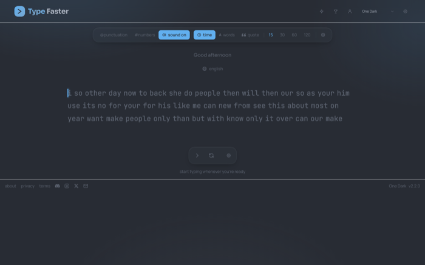
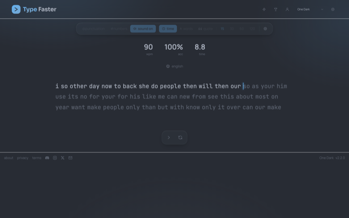

# Type Faster

A typing test app with personalized practice drills and live multiplayer racing. Built as a React web app and shipped natively to iOS and Android through Capacitor.

This repo is a portfolio case study. The app itself is closed source, so what you will find here is screenshots, a plain explanation of how it is built, and a few of the harder bugs I ran into along the way.

## Screenshots

  
  
  

  
  

## Stack

React, Vite, and Tailwind on the frontend. Supabase handles the backend, the database, real time updates, and a bit of server side logic for things like login and leaderboards. Capacitor wraps the same web app into native iOS and Android builds, each signed for release.

## How it is put together

The typing test itself runs entirely client side. Results, the smart coaching drills, and the leaderboard all talk to Supabase behind the scenes. Multiplayer races run over real time channels, players and computer opponents join a room the same way, and the app just renders whoever is in it.

## Some of the harder problems

Getting bots into a race to feel like real opponents rather than a fake progress bar took some care. They join through the exact same channel and presence system a real player would, matched loosely to the player's recent speed, so an empty lobby still turns into a race instead of a wait.

Each racer's look is built from a small set of choices, color, eyes, mouth, and gear, turned into a little illustration on the fly and shared with everyone else in the race. That kept things feeling personalized without needing to send actual images around.

Arabic support was more than just flipping the layout. Getting the cursive script to join up correctly while still coloring each character for accuracy meant rethinking how individual letters were being wrapped, since the obvious approach broke the connected script entirely.

There was also a backend quirk where the login function would silently fail depending on how the request was sent, which took some digging to track down since it worked fine in some environments and not others.

And a good chunk of care went into keeping sensitive checks, like leaderboard lookups and username availability, running on the server instead of trusting the client, so a user's own device can't be tricked into seeing or changing more than it should.

## Also by me

Tanweer for iOS: https://github.com/lqji/tanweer-ios-showcase
Tanweer for Android: https://github.com/lqji/tanweer-android-showcase
Full portfolio: https://github.com/lqji/portfolio

Ahmed Abdullah
